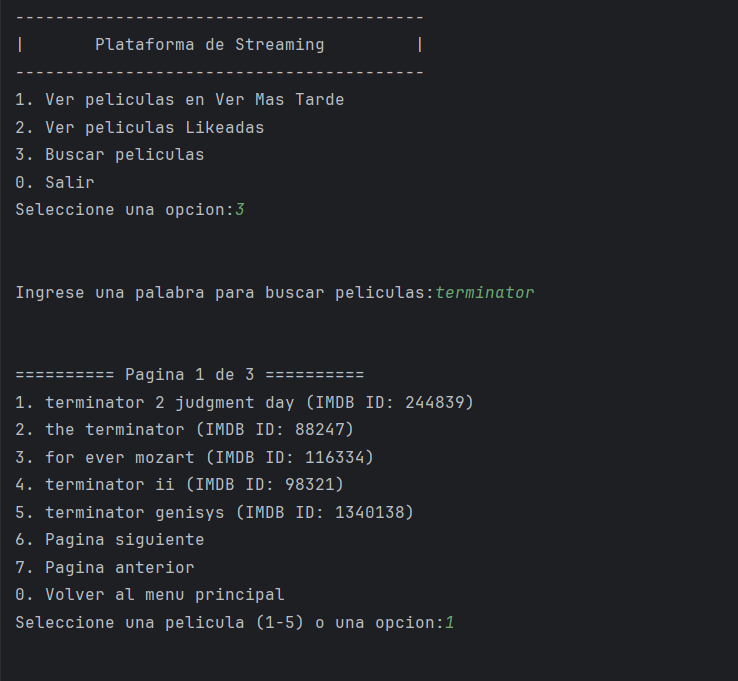
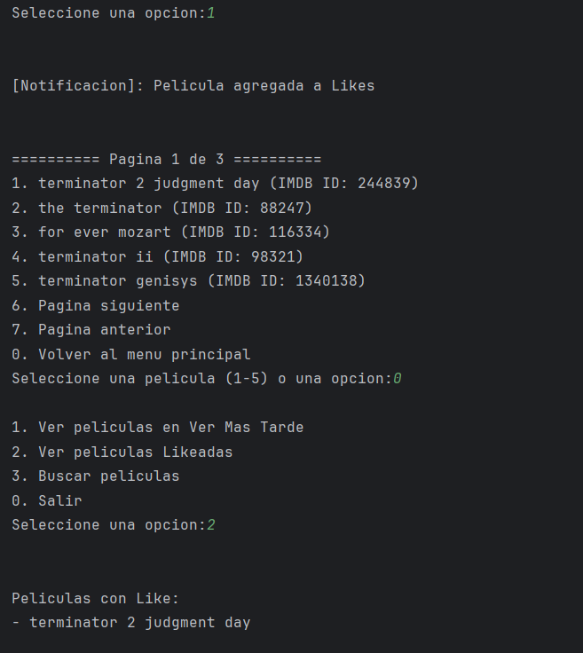
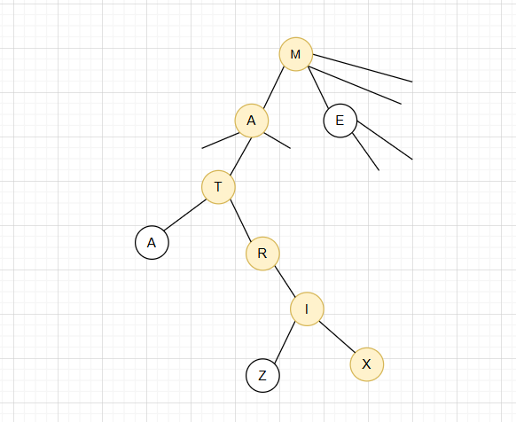

## Plataforma-streaming
proyecto sobre la plataforma de streaming
# Descripción
Este es un proyecto que adapta una pequeña interfaz para poder buscar peliculas, en la cual usa un algoritmo de busqueda de trie para hacerlo, en base a si contienen el patron insertado tanto en su titulo como en su synopsis y te entrega el titulo con su id correspondiente. Ademas de esta funciona cuenta con una funcion para poder visualizar que peliculas fueron likeadas y una funcion de ver mas tarde.
# Caracteristicas 
Se utilizan distintos patrones de diseño:
- El observer para el mecanismo de likes y ver mas tarde
- El composatie o trie para hacer el algoritmo de busqueda de las peliculas
- El decorator para hacer una interfaz mas vistoza
- El factory  para diferenciar una busqueda respecto a otra
# Manejo del CSV
para manejar correctamente los datos creamos un un cpp adicional llamado preprocesamiento de datos en el cual limpiamos todo el csv de caracteres especiales, pasamos a minusculas e incluso limpiamos la columna de los id. A pesar de todas estas incorporaciones seguia presentando errores a la hora de usar el codigo debido a problemas con las comas que se encontraban dentro de las columnas de sinopsis y en los tags a pesar de que esten dentro de las comillas. Debido a esto nos parecio mas sencillo pasar el archivo a un tsv delimitado por saltos de barra en vez de comas para poder trabajar mas facilmente y tuvimos exito con este metodo.

https://drive.google.com/file/d/1iusSIbmXJW_OUBm6X7Ik593rgCGPCPza/view?usp=sharing link al csv original
# Uso 
para usar el codigo solo se debe colocar una tabla en formato tsv en la variable nombre_archivo para que el codigo haga el arbol y corra con la interfaz.
la interfaz de el codigo hecha en la terminal se basa en que el usuario coloque numeros para moverse por la misma y cuenta con paginacion para no abrumar al usuario.

A la hora de buscar la pelicula por ejemplo de buscar matrix se buscara en el trie nodo por nodo hasta dar con la pelicula.

# Peso
A la hora de ver el peso en terminos de big o nos centraremos mas par la busquedas de peliculas. 
Busqueda por tag. ---> Su tiempo seria de O(n) ya que pasaria por toda la lista de las peliculas y verificaria si en los tags en question esta el tag deseado. Siendo n la cantidad de peliculas en nuestro csv.
Para la creacion de nuestro Trie seria aproximadamente de O(n*m) si tomamos el promedio de la longitud de palabras como algo constante = O(n) tanto en tiempo como en espacio. Siendo m el promedio de longitud por pelicula y n la cantidad de peliculas.
Para la busqueda usando nuestro trie seria de O(p) siendo p la longitud del patron que insertamos lo que en caso de patrones pequeños seria constante
